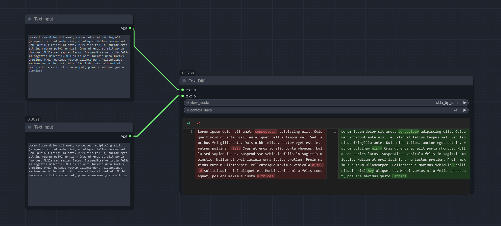
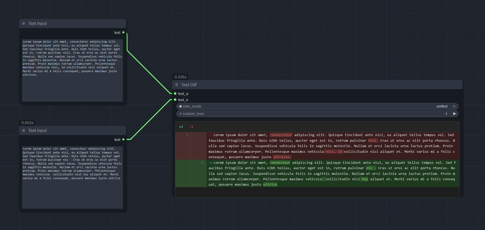

# ComfyUI Text Diff

Compare two text strings with GitHub/GitLab-style diff highlighting in ComfyUI.





## Features

- Line-by-line comparison with line numbers
- Character-level highlighting within changed lines
- Two display modes: **Unified** (single column) and **Side-by-Side** (two columns)
- Instant view mode switching without re-running the workflow
- Context lines control to focus on changes
- No external dependencies (Python standard library only)

## Installation

### Manual Installation

```bash
cd ComfyUI/custom_nodes
git clone https://github.com/dcyd-lun/ComfyUI_text_diff.git
```

Restart ComfyUI after installation.

## Usage

1. Add the **Text Diff** node from `utils/text` category
2. Connect two text inputs (`text_a` and `text_b`)
3. Run the workflow to see the diff
4. Switch between view modes instantly using the dropdown

### Inputs

| Input | Type | Description |
|-------|------|-------------|
| `text_a` | STRING | Original text |
| `text_b` | STRING | Modified text |
| `view_mode` | DROPDOWN | `side_by_side` (default) or `unified` |
| `context_lines` | INT | Lines of context around changes (-1 = show all) |
